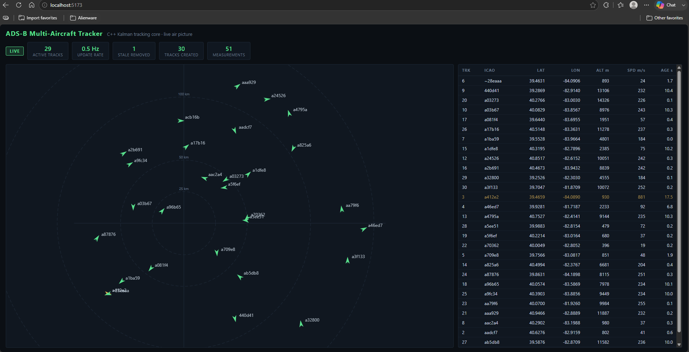
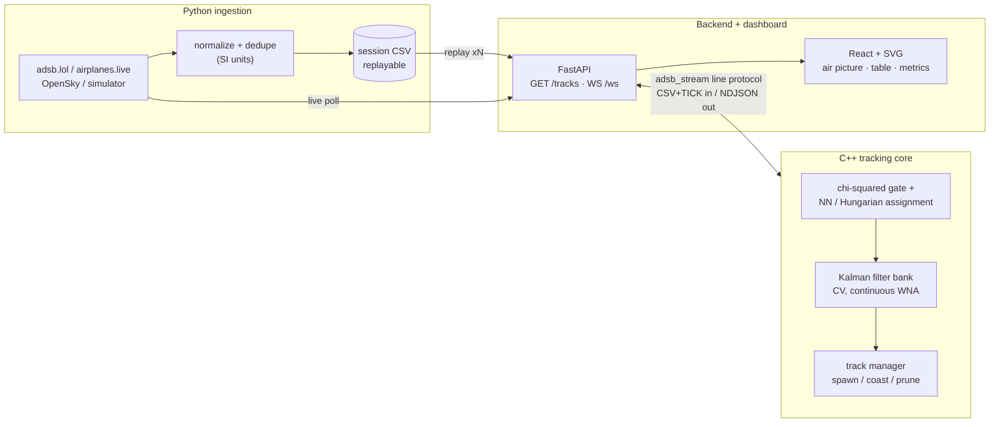

# Multi-Aircraft ADS-B Tracker

[](https://github.com/AdhritSingh21/multi-aircraft-adsb-tracker/actions/workflows/ci.yml)

A real-time multi-target aircraft tracking system: a **C++17 tracking core**
(per-track Kalman filters, χ²-gated nearest-neighbor and Hungarian data
association) fed by **live ADS-B ingestion**, exposed through a
**FastAPI/WebSocket backend**, and visualized on a **React dashboard** with
an SVG radar-style air picture.



*Live validation run: 29 concurrent tracks maintained from a keyless
adsb.lol feed — SVG air picture with heading vectors and range rings,
per-track state table (position, altitude, speed, age), and live metrics.*



## Demo in three commands

Prereqs: CMake ≥ 3.16 + a C++17 compiler, Python 3.11+ with
`pip install -r backend/requirements.txt`, Node 20+.

```sh
# 1. build the tracking core
cmake -S cpp -B cpp/build -G Ninja -DCMAKE_BUILD_TYPE=Release && cmake --build cpp/build

# 2. backend: replays a real recorded 36-aircraft session through the tracker
uvicorn backend.app:app --port 8000

# 3. dashboard
cd dashboard && npm install && npm run dev    # open http://localhost:5173
```

## Measured results

All numbers re-measured at this commit; every row lists its reproduction
command (run from the repo root).

| Metric | Result | Reproduce |
|---|---|---|
| Association accuracy, identities **hidden** from the tracker (scored against ADS-B ids) | **99.23%** (257/259) on a real 36-aircraft live session; **100%** (70/70) on the 3-aircraft sample | `cpp/build/adsb_replay data/session_live_columbus.csv --assoc nn` (or `hungarian`) |
| Active tracks maintained | 32 active at session end, 37 created (live session, id mode); 31 concurrent observed on the dashboard | `cpp/build/adsb_replay data/session_live_columbus.csv` |
| Stale tracks removed (30 s coast limit) | 5 (live/id), 7 (live/geometric), 1 (sample) | same commands as above |
| Snapshot update rate | ≤ 2 Hz by design (0.5 s tick throttle); 0.3–1 Hz observed during replays — bounded by the ~10 s poll cadence of the source feed, reported as measured | `backend/feeds.py` + dashboard metrics bar |
| Live data capture | 300 measurements, 36 aircraft, 10 polls, 0 failures (90 s over Columbus, OH via adsb.lol) | `python -m ingest record --out out.csv --duration 90` |
| Test suites | 17 C++ tests / 100 checks; 30 Python tests; strict-TypeScript build clean (198 kB bundle, 62.7 kB gzip) | `ctest --test-dir cpp/build` · `python -m pytest backend/tests ingest/tests -q` · `cd dashboard && npm run build` |

Notes reported honestly rather than hidden: greedy NN and Hungarian score
identically on this traffic (aircraft are rarely close enough for the
crossing case — the unit tests demonstrate where Hungarian wins), and
sustained maneuvers fragment geometric tracks (8 tracks created for 3
sample aircraft) — see [Known limitations](#known-limitations).

## What this project demonstrates

- **State estimation** — constant-velocity Kalman filters with the
  continuous white-noise-acceleration process model, chosen (and unit-tested)
  for its predict-composition property so covariance growth is independent
  of scan cadence; filters learn velocity from noisy positions alone.
- **Multi-target tracking** — track lifecycle (spawn, update, coast, prune),
  χ² gating on innovation covariance, greedy global-nearest-neighbor and
  Hungarian (Kuhn–Munkres) assignment validated against brute-force optima.
- **Honest evaluation** — association runs with identities hidden and is
  scored against ADS-B ids as ground truth; failure modes are measured and
  documented, not hidden.
- **C++17 systems code** — zero-dependency core (hand-rolled 4×4 filter
  math), static-linked CLI tools, CMake/CTest, assert-based test harness.
- **Real sensor-data handling** — three live ADS-B APIs with messy realities
  normalized honestly: millisecond vs second epochs, feet/knots vs SI,
  `"ground"` sentinels, stale retained positions, timestamp jitter dedupe.
- **Component integration over an ICD** — the backend drives the tracker
  through a line protocol (`CSV + TICK` in, NDJSON out) across a process
  boundary; each side is independently testable.
- **Full-stack delivery** — FastAPI + WebSocket streaming, React 19 + strict
  TypeScript dashboard with a dependency-free SVG air picture.

## Defense/aerospace relevance

ADS-B is a cooperative sensor, and this project says so plainly — but the
pipeline is deliberately built like a radar tracker: measurements are
projected into a local tangent frame, filtered, gated, and associated
purely kinematically (the `--assoc nn|hungarian` modes never see aircraft
identity). Those are the same estimation and data-association foundations
used in radar/EO multi-sensor tracking, C2 air pictures, and sensor-fusion
systems. The replay-first design (record once, replay deterministically,
score against truth) mirrors how tracking algorithms are actually evaluated
in that domain.

## How it works

Full walkthrough with file pointers, the stream-bridge protocol table, and
a sequence diagram: [docs/ARCHITECTURE.md](docs/ARCHITECTURE.md).

Repository layout:

```
cpp/                C++17 tracking core: Kalman filter, association, track
                    manager + adsb_replay (evaluation) + adsb_stream (bridge)
ingest/             Python ingestion: live clients (adsb.lol, airplanes.live,
                    OpenSky), deterministic simulator, recorder, replayer
backend/            FastAPI + WebSocket server driving the C++ tracker
dashboard/          React/Vite dashboard: SVG air picture, track table,
                    live metrics
data/               deterministic sample + recorded live sessions (replayable)
docs/               architecture documentation
```

## Build, test, and run everything

```sh
# C++ core + tests (any C++17 compiler; MinGW builds are static-linked)
cmake -S cpp -B cpp/build -G Ninja -DCMAKE_BUILD_TYPE=Release
cmake --build cpp/build
ctest --test-dir cpp/build --output-on-failure

# Python tests (ingestion + backend; no network needed)
python -m pytest backend/tests ingest/tests -q

# replay evaluation — association modes: id (trust ADS-B identity),
# nn / hungarian (identities hidden, geometric association, scored)
cpp/build/adsb_replay data/session_live_columbus.csv --assoc hungarian

# record your own session (keyless live sources) or a simulated one
python -m ingest record --out data/mysession.csv --duration 90
python -m ingest record --out data/sim.csv --source sim --duration 75 --interval 5

# backend + dashboard (see "Demo in three commands")
uvicorn backend.app:app --port 8000     # env: ADSB_SESSION, ADSB_SPEED, ADSB_ASSOC, ADSB_SOURCE
```

## Known limitations

- **Maneuver fragmentation (measured):** in geometric modes a sustained turn
  can exceed the CV model's gate and split a track — 8 tracks created for 3
  aircraft on the maneuvering sample. Fix path: higher process noise or an
  IMM filter; deliberately deferred to keep results honest rather than tuned
  to one dataset.
- **Cooperative, single sensor:** ADS-B only — no radar, no multi-sensor
  fusion; association difficulty is bounded by real traffic geometry.
- **Scan approximation:** live aggregator reports are not synchronized
  radar scans; the evaluator buckets them into 1 s windows.
- **Regional frame:** the equirectangular tangent plane is valid for
  regional scopes, not continental ones.
- **Data rates:** anonymous/keyless feeds update ~1–10 s per aircraft;
  update-rate metrics reflect that ceiling, not system throughput limits.

## Future work

Process-noise tuning / IMM for maneuver robustness · Leaflet basemap option
· continuous live-tracking daemon mode · dense-traffic Hungarian-vs-NN study.

## License

[MIT](LICENSE) — © 2026 Adhrit Singh.
