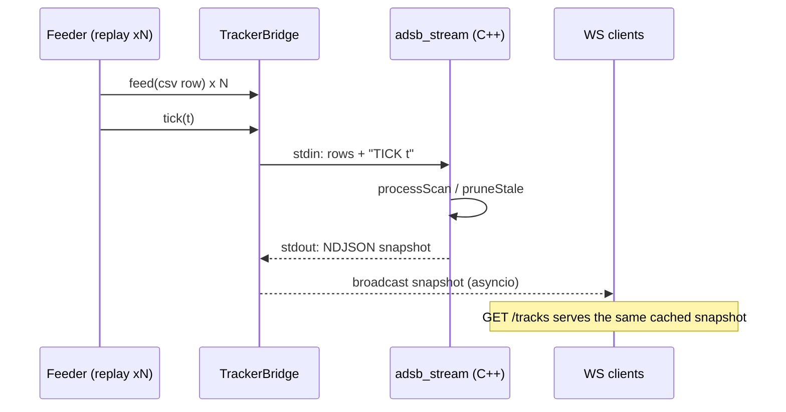

# Architecture

A multi-target aircraft tracker built as five cooperating components with
one shared data contract. The C++ core is the only place tracking happens;
everything else feeds it or presents its output.

```
ADS-B sources ──► Python ingestion ──► session CSV ──► C++ tracking core ──► FastAPI backend ──► React dashboard
 (adsb.lol,        normalize, dedupe,   (replayable)     Kalman + gating +     /tracks, /ws        SVG air picture,
  airplanes.live,  record, replay                        NN/Hungarian          WebSocket           table, metrics
  OpenSky, sim)                                          association           broadcast
```

## Components

### 1. Ingestion (`ingest/`, Python, stdlib-only)
- **Clients** — [`readsb.py`](../ingest/readsb.py) speaks the keyless
  community v2 point API (adsb.lol, airplanes.live: `now` in *milliseconds*,
  altitude in feet or the string `"ground"`, speed in knots, positions
  backdated by `seen_pos`); [`opensky.py`](../ingest/opensky.py) speaks
  OpenSky `/states/all` (SI-native, `time_position`-only policy so stale
  retained fixes are never stamped fresh); [`simsource.py`](../ingest/simsource.py)
  is a deterministic OpenSky-shaped simulator for offline demos.
- **Normalizer** — everything becomes the 7-column measurement format
  (SI units, lowercase ICAO24):
  `aircraft_id,timestamp,latitude,longitude,altitude,velocity,heading`.
- **Recorder** ([`recorder.py`](../ingest/recorder.py)) — polls a source,
  drops re-reports and timestamp-jitter near-duplicates via per-aircraft
  minimum separation (0.5 s), flushes the session CSV after every poll so an
  interrupted recording is still replayable.
- **Replayer** ([`replayer.py`](../ingest/replayer.py)) — re-emits a session
  with original or speed-scaled timing; this is the repeatable-demo path.

### 2. Tracking core (`cpp/`, C++17, zero external dependencies)
- **Coordinate frame** ([`measurement.hpp`](../cpp/include/adsb/measurement.hpp)) —
  lat/lon is projected to a local east/north tangent plane (equirectangular)
  around the first report, keeping the filter linear. Valid for regional
  scopes; error is far below sensor noise at a few hundred km.
- **Kalman filter** ([`kalman_filter.cpp`](../cpp/src/kalman_filter.cpp)) —
  per-track linear KF, state `[x, y, vx, vy]`, constant-velocity model,
  position-only updates (R = σ²·I, σ = 50 m for GNSS-grade ADS-B).
  Process noise uses the **continuous** white-noise-acceleration
  discretization (`Q ∝ dt³/3, dt²/2, dt`), chosen because it composes:
  `predict(a); predict(b) ≡ predict(a+b)`. The geometric associator predicts
  every track at every scan, so covariance growth must not depend on scan
  cadence — a unit test pins this property.
- **Association** ([`association.cpp`](../cpp/src/association.cpp)) — squared
  Mahalanobis distance against each track's innovation covariance, gated at
  χ² = 9.21 (2 DOF, 99%). Two solvers behind one interface: greedy global
  nearest neighbor, and the Hungarian algorithm (Kuhn–Munkres, O(n³)
  potentials form) for globally optimal assignment — unit-tested against
  brute-force permutation optima and the classic crossing-cost case where
  greedy is provably suboptimal.
- **Track manager** ([`track_manager.cpp`](../cpp/src/track_manager.cpp)) —
  two operating styles: `processMeasurement()` associates by ADS-B identity
  (cooperative baseline), `processScan()` associates geometrically with
  identities ignored, as a non-cooperative sensor would have to. Unmatched
  measurements spawn tracks; tracks coast and are pruned after 30 s without
  an update. Every decision is reported (`ScanResult`) so replays can be
  scored against ADS-B ids as ground truth.

### 3. Stream bridge (`cpp/src/stream_main.cpp` → `adsb_stream`)
A deliberate interface-control boundary: the backend never links C++ code.

| Direction | Line format | Meaning |
|-----------|-------------|---------|
| stdin     | `id,ts,lat,lon,alt,vel,hdg` | buffer one measurement into the current scan |
| stdin     | `TICK <t>`  | process the scan, prune stale tracks at `t`, emit one snapshot |
| stdout    | one JSON object per line (NDJSON) | tracks + lifetime stats, flushed immediately |

Snapshot schema (produced by [`json_out.cpp`](../cpp/src/json_out.cpp)):

```json
{"time": 1783103327.1,
 "tracks": [{"id": 1, "icao": "a1b2c3", "lat": 40.1, "lon": -82.9,
             "alt_m": 10500.0, "speed_mps": 220.0, "heading_deg": 90.0,
             "age_s": 1.0, "hits": 5, "trail": [[40.1, -82.9]]}],
 "stats": {"measurements": 183, "tracks_created": 37,
           "stale_removed": 5, "active": 34}}
```

Why a subprocess protocol instead of pybind11: on Windows, MinGW-built
Python extensions against an MSVC CPython are ABI-fragile; a line protocol
is robust, independently testable from both sides, and mirrors how real
systems integrate components across an ICD.

### 4. Backend (`backend/`, FastAPI)
[`bridge.py`](../backend/bridge.py) owns the `adsb_stream` subprocess (writer
+ daemon reader thread); [`feeds.py`](../backend/feeds.py) pushes a replayed
session (tick-throttled to ≤2 snapshots/s) or a live poll into it;
[`app.py`](../backend/app.py) serves `GET /tracks` (latest snapshot),
`GET /healthz` (API + tracker liveness), and `WS /ws` (latest on connect,
then every new snapshot).



### 5. Dashboard (`dashboard/`, React 19 + Vite + strict TypeScript)
One hook ([`useTrackStream.ts`](../dashboard/src/useTrackStream.ts)) seeds
from `GET /tracks`, follows `WS /ws` with capped-backoff reconnect, and
derives the update rate from message arrival times. Three presentational
components: [`AirPicture.tsx`](../dashboard/src/components/AirPicture.tsx)
(SVG air picture — heading-oriented markers, trail polylines, range rings,
expand-only auto-fit, using the same tangent-plane projection as the C++
core), `TrackTable.tsx`, and `MetricsBar.tsx`. Deliberately tile-free:
demos run fully offline with zero map-service dependencies.

## Testing strategy

| Layer | Suite | What it pins |
|-------|-------|--------------|
| C++ core | 17 tests / 100 checks (`ctest`) | filter convergence from noisy positions alone, predict composition, gate math, Hungarian vs brute force, identity-free association continuity, stale pruning, CSV robustness, JSON contract |
| Python | 30 tests (`pytest`) | normalizer unit conversions against real API payloads, recorder dedupe/failure handling with fake clocks, replay pacing, session round-trip, API/WS behavior with a fake bridge, real-subprocess bridge integration |
| End-to-end | scripted + visual | recorded 36-aircraft live session replayed through core → backend → WebSocket → dashboard, confirmed by probes and human inspection |

All performance claims in the [README](../README.md) come from these runs —
numbers are re-measured at the commit that quotes them.
